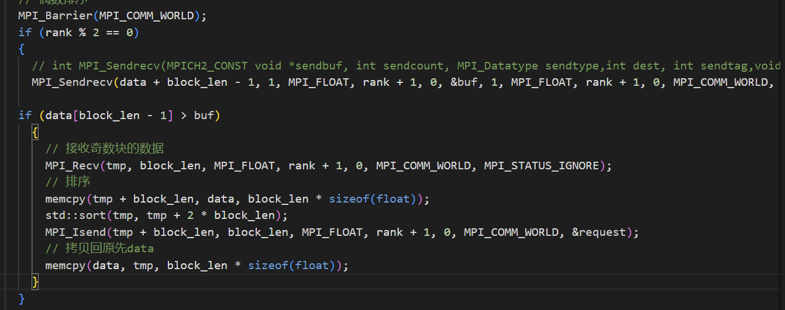

# PA1 实验报告
于新雨 计25 2022010841
## 代码
为保证代码可读性，删去了大段的调试代码，其中调试代码是用 DEBUG 宏的形式，在编译预处理时确定是否需要输出 debug 信息到文件中，所以去掉 `ifdef debug` 编译理论上不会有性能损耗     
代码中具体实现详见以下部分和注释
```c
#include <algorithm>
#include <cassert>
#include <cstdio>
#include <cstdlib>
#include <cstring>
#include <mpi.h>
#include <vector>
#include "worker.h"

// array:用宏的方法在 merge 的时候 获取两个数组的元素
#define array(a, b, c, block_len) (((size_t)(c) >= (block_len)) ? ((b)[c - block_len]) : ((a)[c]))
void Worker::sort()
{
  /** Your code ... */
  // you can use variables in class Worker: n, nprocs, rank, block_len, data
  // 拿取自己的块并且排序
  // bucket sort
  float buf = 0;                          // 用来存相邻进程传过来用于判断是否交换的元素
  int ceil = (n + nprocs - 1) / nprocs;   // .h 中的大部分 block_size 的值
  int true_procs = (n + ceil - 1) / ceil; // data 非空的 进程数量，大于等于 true_procs 的进程为空data
  if (rank >= true_procs)
  {
    return; // 空 data 不参与后续过程
  }
  // 块内排序
  if (n <= 10000)
  { // n 小于等于10000 时，用 std::sort 的开销会低
    std::sort(data, data + block_len);
  }
  else
  { // n 大于10000 时，用 radix sort 性能会好
    std::vector<float> bucket[256];
    for (size_t i = 0; i < block_len; i++)
    {
      int *p = (int *)&data[i];
      *p = ((*p) >> 31 & 0x1) ? ~(*p) : (*p) | 0x80000000;
    }
    for (int i = 0; i < 4; i++)
    {
      for (int j = 0; (size_t)j < block_len; j++)
        bucket[(*(int *)(&data[j])) >> (i * 8) & 0xff].push_back(data[j]);
      int count = 0;
      for (int j = 0; j < 256; j++)
      {
        for (int k = 0; k < (int)bucket[j].size(); k++)
          data[count++] = bucket[j][k];
        bucket[j].clear();
      }
    }
    for (size_t i = 0; i < block_len; i++)
    {
      int *p = (int *)&data[i];
      *p = ((*p) >> 31 & 0x1) ? (*p) & 0x7fffffff : ~(*p);
    }
  }
  if (nprocs == 1)
  {
    return;
  }
  // 复用worker.h 中的 last_rank, out_of_range，分别表示本组是否需要交换和整体是否需要交换
  // 互相交换元素，如果是偶数块，发现需要排序就像前一个奇数块发送flag,像后一个奇数块发自己所有块，

  float *tmp = new float[ceil + 1];  // 用于 merge 的临时数组
  float *buf1 = new float[ceil + 1]; // 接收相邻进程传过来的数据


  int next_len = ((rank == true_procs - 2) ? (n - (true_procs - 1) * ceil) : (ceil)); // 下一块长度
  int prev_len = ((rank == 0) ? 0 : ceil);                                            // 前一块长度
  if (true_procs % 2 == 0)
  { // true_procs 是否是2的倍数 进行分类讨论
    for (int ii = 0; ii < (true_procs) / 2; ii++)
    {
      // 偶数排序
      if (rank % 2 == 0)
      {
        // extern function declaration: int MPI_Sendrecv(MPICH2_CONST void *sendbuf, int sendcount, MPI_Datatype sendtype,int dest, int sendtag,void *recvbuf, int recvcount, MPI_Datatype recvtype,int source, int recvtag,MPI_Comm comm, MPI_Status *status)

        MPI_Sendrecv(data + block_len - 1, 1, MPI_FLOAT, rank + 1, 0, &buf, 1, MPI_FLOAT, rank + 1, 0, MPI_COMM_WORLD, MPI_STATUS_IGNORE);
        if (data[block_len - 1] > buf)
        {
          // 接收奇数块的数据
          MPI_Sendrecv(data, block_len, MPI_FLOAT, rank + 1, 0, buf1, next_len, MPI_FLOAT, rank + 1, 0, MPI_COMM_WORLD, MPI_STATUS_IGNORE);
          // merge
          // 和用 std::merge 相比，手动实现merge 来只 merge 前一半
          float *start_ptr = data, *start1_ptr = buf1, *res = tmp, *last = data + block_len, *last1 = buf1 + next_len;
          size_t cnt = 0;
          // 只用排序前一半
          while ((cnt < block_len) && start_ptr < last && start1_ptr < last1)
          {
            if (*start_ptr < *start1_ptr)
            {
              *res = *start_ptr;
              start_ptr++;
            }
            else
            {
              *res = *start1_ptr;
              start1_ptr++;
            }
            res++;
            cnt++;
          }
          if (cnt < block_len)
          { // 一定是start1_ptr 对应的用完了
            for (; cnt < block_len; cnt++, res++, start_ptr++)
              *res = *start_ptr;
          }
          // 交换 tmp,data 省略一次拷贝
          float *tmmp = data;
          data = tmp;
          tmp = tmmp;
        }
      }
      else
      {
        // 相邻块传数据判断是否需要块间排序
        MPI_Sendrecv(data, 1, MPI_FLOAT, rank - 1, 0, &buf, 1, MPI_FLOAT, rank - 1, 0, MPI_COMM_WORLD, MPI_STATUS_IGNORE);
        if (data[0] < buf) // 需要排序
        {
          MPI_Sendrecv(data, block_len, MPI_FLOAT, rank - 1, 0, buf1, prev_len, MPI_FLOAT, rank - 1, 0, MPI_COMM_WORLD, MPI_STATUS_IGNORE);
          // 反向 merge
          float *start = data + block_len - 1, *start1 = buf1 + prev_len - 1, *res = tmp + block_len - 1, *last = data - 1, *last1 = buf1 - 1;
          size_t cnt = 0;
          while ((cnt < block_len) && (start > last) && start1 > last1)
          {
            if (*start > *start1)
            {
              *res = *start;
              start--;
            }
            else
            {
              *res = *start1;
              start1--;
            }
            res--;
            cnt++;
          }
          // prev_len 一定比自己大或者相等，所以直接交换指针即可完成
          float *tmmp = data;
          data = tmp;
          tmp = tmmp;
        }
      }
      // 奇数排序,除去边界情况，和偶数排序大差不差
      if (rank % 2 == 1)
      {
        // 和自己后一个偶数块绑定
        if (rank != true_procs - 1)
        {
          // 判断是否需要相邻块排序
          MPI_Sendrecv(data + block_len - 1, 1, MPI_FLOAT, rank + 1, 0, &buf, 1, MPI_FLOAT, rank + 1, 0, MPI_COMM_WORLD, MPI_STATUS_IGNORE);

          if (data[block_len - 1] > buf)
          {
            // merge
            // 接收奇数块的数据
            MPI_Sendrecv(data, block_len, MPI_FLOAT, rank + 1, 0, buf1, block_len, MPI_FLOAT, rank + 1, 0, MPI_COMM_WORLD, MPI_STATUS_IGNORE);
            // merge
            float *start_ptr = data, *start1_ptr = buf1, *res = tmp, *last = data + block_len, *last1 = buf1 + block_len;
            size_t cnt = 0;
            // 只用排序前一半
            while ((cnt < block_len) && start_ptr < last && start1_ptr < last1)
            {
              if (*start_ptr < *start1_ptr)
              {
                *res = *start_ptr;
                start_ptr++;
              }
              else
              {
                *res = *start1_ptr;
                start1_ptr++;
              }
              res++;
              cnt++;
            }
            float *tmmp = data;
            data = tmp;
            tmp = tmmp;
          }
        }
      }
      else if (rank % 2 == 0)
      {
        if (rank != 0)
        {
          // 如果需要交换 则像自己前一个奇数块发送自己所有数据
          MPI_Sendrecv(data, 1, MPI_FLOAT, rank - 1, 0, &buf, 1, MPI_FLOAT, rank - 1, 0, MPI_COMM_WORLD, MPI_STATUS_IGNORE);
          if (data[0] < buf)
          {
            MPI_Sendrecv(data, block_len, MPI_FLOAT, rank - 1, 0, buf1, block_len, MPI_FLOAT, rank - 1, 0, MPI_COMM_WORLD, MPI_STATUS_IGNORE);
            // 反向 merge
            // 参考 std::merge 源码实现 merge
            float *start = data + block_len - 1, *start1 = buf1 + block_len - 1, *res = tmp + block_len - 1, *last = data - 1, *last1 = buf1 - 1;
            size_t cnt = 0;
            while ((cnt < block_len) && (start > last) && start1 > last1)
            {
              if (*start > *start1)
              {
                *res = *start;
                start--;
              }
              else
              {
                *res = *start1;
                start1--;
              }
              res--;
              cnt++;
            }
            float *tmmp = data;
            data = tmp;
            tmp = tmmp;
          }
        }
      }
    }
    if (rank % 2 == 0)
    {
      // int MPI_Sendrecv(MPICH2_CONST void *sendbuf, int sendcount, MPI_Datatype sendtype,int dest, int sendtag,void *recvbuf, int recvcount, MPI_Datatype recvtype,int source, int recvtag,MPI_Comm comm, MPI_Status *status)
      MPI_Sendrecv(data + block_len - 1, 1, MPI_FLOAT, rank + 1, 0, &buf, 1, MPI_FLOAT, rank + 1, 0, MPI_COMM_WORLD, MPI_STATUS_IGNORE);
      if (data[block_len - 1] > buf)
      {
        // 接收奇数块的数据
        MPI_Sendrecv(data, block_len, MPI_FLOAT, rank + 1, 0, buf1, next_len, MPI_FLOAT, rank + 1, 0, MPI_COMM_WORLD, MPI_STATUS_IGNORE);
        // merge
        float *start_ptr = data, *start1_ptr = buf1, *res = tmp, *last = data + block_len, *last1 = buf1 + next_len;
        size_t cnt = 0;
        // 只用排序前一半
        while ((cnt < block_len) && start_ptr < last && start1_ptr < last1)
        {
          if (*start_ptr < *start1_ptr)
          {
            *res = *start_ptr;
            start_ptr++;
          }
          else
          {
            *res = *start1_ptr;
            start1_ptr++;
          }
          res++;
          cnt++;
        }
        if (cnt < block_len)
        { // 一定是start1_ptr 对应的用完了
          for (; cnt < block_len; cnt++, res++, start_ptr++)
            *res = *start_ptr;
        }
        // 交换指针代替拷贝
        float *tmmp = data;
        data = tmp;
        tmp = tmmp;
      }
    }
    else
    {
      MPI_Sendrecv(data, 1, MPI_FLOAT, rank - 1, 0, &buf, 1, MPI_FLOAT, rank - 1, 0, MPI_COMM_WORLD, MPI_STATUS_IGNORE);
      if (data[0] < buf)
      {
        MPI_Sendrecv(data, block_len, MPI_FLOAT, rank - 1, 0, buf1, block_len, MPI_FLOAT, rank - 1, 0, MPI_COMM_WORLD, MPI_STATUS_IGNORE);
        // 反向 merge
        float *start = data + block_len - 1, *start1 = buf1 + prev_len - 1, *res = tmp + block_len - 1, *last = data - 1, *last1 = buf1 - 1;
        size_t cnt = 0;
        while ((cnt < block_len) && (start > last) && start1 > last1)
        {
          if (*start > *start1)
          {
            *res = *start;
            start--;
          }
          else
          {
            *res = *start1;
            start1--;
          }
          res--;
          cnt++;
        }
        float *tmmp = data;
        data = tmp;
        tmp = tmmp;
      }
    }
  }
  else
  {
    // 奇数个块
    for (int ii = 0; ii < (true_procs + 1) / 2; ii++)
    {
      // 偶数排序

      if ((rank % 2 == 0) && (rank != true_procs - 1))
      {
        // int MPI_Sendrecv(MPICH2_CONST void *sendbuf, int sendcount, MPI_Datatype sendtype,int dest, int sendtag,void *recvbuf, int recvcount, MPI_Datatype recvtype,int source, int recvtag,MPI_Comm comm, MPI_Status *status)
        MPI_Sendrecv(data + block_len - 1, 1, MPI_FLOAT, rank + 1, 0, &buf, 1, MPI_FLOAT, rank + 1, 0, MPI_COMM_WORLD, MPI_STATUS_IGNORE);
        if (data[block_len - 1] > buf)
        {
          // 接收奇数块的数据
          MPI_Sendrecv(data, block_len, MPI_FLOAT, rank + 1, 0, buf1, next_len, MPI_FLOAT, rank + 1, 0, MPI_COMM_WORLD, MPI_STATUS_IGNORE);
          // merge

          float *start_ptr = data, *start1_ptr = buf1, *res = tmp, *last = data + block_len, *last1 = buf1 + next_len;
          size_t cnt = 0;
          // 只用排序前一半
          while ((cnt < block_len) && start_ptr < last && start1_ptr < last1)
          {
            if (*start_ptr < *start1_ptr)
            {
              *res = *start_ptr;
              start_ptr++;
            }
            else
            {
              *res = *start1_ptr;
              start1_ptr++;
            }
            res++;
            cnt++;
          }

          float *tmmp = data;
          data = tmp;
          tmp = tmmp;
        }
      }
      else if (rank % 2 == 1)
      {

        MPI_Sendrecv(data, 1, MPI_FLOAT, rank - 1, 0, &buf, 1, MPI_FLOAT, rank - 1, 0, MPI_COMM_WORLD, MPI_STATUS_IGNORE);

        if (data[0] < buf)
        {

          MPI_Sendrecv(data, block_len, MPI_FLOAT, rank - 1, 0, buf1, prev_len, MPI_FLOAT, rank - 1, 0, MPI_COMM_WORLD, MPI_STATUS_IGNORE);
          // 反向 merge
          float *start = data + block_len - 1, *start1 = buf1 + prev_len - 1, *res = tmp + block_len - 1, *last = data - 1, *last1 = buf1 - 1;
          size_t cnt = 0;
          while ((cnt < block_len) && (start > last) && start1 > last1)
          {
            if (*start > *start1)
            {
              *res = *start;
              start--;
            }
            else
            {
              *res = *start1;
              start1--;
            }
            res--;
            cnt++;
          }
          // prev_len 一定比自己大或者相等
          float *tmmp = data;
          data = tmp;
          tmp = tmmp;
        }
      }
      // 奇数排序
      if (rank % 2 == 1)
      {
        // 和自己后一个偶数块绑定
        MPI_Sendrecv(data + block_len - 1, 1, MPI_FLOAT, rank + 1, 0, &buf, 1, MPI_FLOAT, rank + 1, 0, MPI_COMM_WORLD, MPI_STATUS_IGNORE);
        if (data[block_len - 1] > buf)
        {
          // merge
          // 接收偶数块的数据
          MPI_Sendrecv(data, block_len, MPI_FLOAT, rank + 1, 0, buf1, next_len, MPI_FLOAT, rank + 1, 0, MPI_COMM_WORLD, MPI_STATUS_IGNORE);
          // merge
          float *start_ptr = data, *start1_ptr = buf1, *res = tmp, *last = data + block_len, *last1 = buf1 + next_len;
          size_t cnt = 0;
          // 只用排序前一半
          while ((cnt < block_len) && start_ptr < last && start1_ptr < last1)
          {
            if (*start_ptr < *start1_ptr)
            {
              *res = *start_ptr;
              start_ptr++;
            }
            else
            {
              *res = *start1_ptr;
              start1_ptr++;
            }
            res++;
            cnt++;
          }
          if (cnt < block_len)
          { // 一定是start1_ptr 对应的用完了
            for (; cnt < block_len; cnt++, res++, start_ptr++)
              *res = *start_ptr;
          }
          // 拷贝回原先data
          float *tmmp = data;
          data = tmp;
          tmp = tmmp;
        }
      }
      else if (rank % 2 == 0)
      {
        if (rank != 0)
        {
          // 如果需要交换 则像自己前一个奇数块发送自己所有数据
          MPI_Sendrecv(data, 1, MPI_FLOAT, rank - 1, 0, &buf, 1, MPI_FLOAT, rank - 1, 0, MPI_COMM_WORLD, MPI_STATUS_IGNORE);
          if (data[0] < buf)
          {
            MPI_Sendrecv(data, block_len, MPI_FLOAT, rank - 1, 0, buf1, prev_len, MPI_FLOAT, rank - 1, 0, MPI_COMM_WORLD, MPI_STATUS_IGNORE);
            // 反向 merge
            float *start = data + block_len - 1, *start1 = buf1 + prev_len - 1, *res = tmp + block_len - 1, *last = data - 1, *last1 = buf1 - 1;
            size_t cnt = 0;
            while ((cnt < block_len) && (start > last) && start1 > last1)
            {
              if (*start > *start1)
              {
                *res = *start;
                start--;
              }
              else
              {
                *res = *start1;
                start1--;
              }
              res--;
              cnt++;
            }
            float *tmmp = data;
            data = tmp;
            tmp = tmmp;
          }
        }
      }
    }
  }
}

```
## 优化及效果
- 循环判断终止
  - 一开始写法是这样子的,类比 allgather 的写法：
    - 
  - 但是每次都这样send，recv 多次真的开销比较大,测出来是性能线的10~30倍
  - 之后和同学讨论后决定采取循环（nproc+1）次的方法一定可以排好序，因为减小了大约一半的消息传递开销，所以性能变到了性能线的3~5倍
- 换 radix sort
  - 在数据大于10000 时，用 radix sort 对浮点数进行排序，可以降到O(n) 量级的复杂度，但是小数据集上因为常数比较大所以会比 std::sort 慢一些
  - 效果是，最后的一组测例由780 ms 左右降到了 650 ms 左右
- merge 改进
  - 一开始写法：如果发现相邻进程需要排序，就把奇数数据 send 到偶数进程里面，偶数进程 调用 std::merge 后把对应的一半发给奇数进程
  - 改进：相邻进程需要排序时，奇数偶数进程同时 SendRecv,双方拿到全部数据时，各排序自己需要的一半，其好处是可以减少一次 send 的开销和 merge 常数时间减半
  - 效果是，在同时进行该优化和下面的用交换指针代替 memcpy 的操作后，可以将原本1.5倍性能线的数据提到性能线附近
- 绕过 memcpy
  - 非原地的 merge 操作是会把 merge 完的一半数据放到另一个数组之中，然后用我们的 merge 完后把 tmp 中的数据用 memcpy 拷回到 data 里面
  - 改进：经同学提醒，把 memcpy 的操作改成了交换 data 和 tmp 指针，效果为和前面一个优化一起 把性能拉到了性能线附近
- 改编译选项
  - 在加 radix sort 之后，把 -O2 的 flag 改了 -O3，提高编译优化程度，结果是最高的一组测例提高 20 ms 左右
- 没有什么效果的改进
  - 看到了由于数据随机性，所以前面若干次循环几乎都要相邻进程之间排序，于是觉得可以省去一开始交换数据的时间，做法就是在前（nproc/2）或者前（nproc/3）的循环不做一开始的单个元素SendRecv，直接合并判断
    - 发现性能基本没有提高
  - 改编译选项
    - 把 -O3 进一步改为 -OFast，发现最高的两组测例性能不增反降，而且在有浮点数的情况下用-OFast 其实不太好，因为会有精度缺失问题

## 性能

| 进程数  |  时间（ms）  | 加速比   |
|---------|------------|----------|
| 1        |3724       | 1        |
| 2        |2571       | 1.44     |
| 4        |1382       | 2.70     |
| 8        | 980       | 3.8      |
| 16       | 748       | 4.98     |
| 2*16     | 666       |5.59      |